# Installation

1. 安装 Python3

2. ```
   pip install -r requirements.txt
   ```

   


# Requirement

**表格格式均为 `.csv`，建议使用 `utf-8` 编码。**

**允许空值存在，空值为 `NaN`，不能由其它符号表示。**


## 历史交易数据文件格式 

列的格式为：

```
Data columns (total 14 columns):
 #   Column  Non-Null Count  Dtype  
---  ------  --------------  -----  
 0   股票代码    5003 non-null   object 
 1   名称      5003 non-null   object 
 2   收盘价     5003 non-null   float64
 3   最高价     5003 non-null   float64
 4   最低价     5003 non-null   float64
 5   开盘价     5003 non-null   float64
 6   前收盘     5003 non-null   float64
 7   涨跌额     4929 non-null   float64
 8   涨跌幅     4929 non-null   float64
 9   换手率     5003 non-null   float64
 10  成交量     5003 non-null   int64  
 11  成交金额    5003 non-null   float64
 12  总市值     5003 non-null   float64
 13  流通市值    5003 non-null   float64
 dtypes: float64(11), int64(1), object(2)
```

索引为 `datetime` 格式或可以转换为 `datetime` 的格式。

调用 `analyze_financial_statements` 后会新增 “市盈率(动)”、“市盈率(静)” 和 “市盈率(TTM)” 列，其类型均为 `float64`。


## 财务报表文件格式

列的格式为：

```
Data columns (total 23 columns):
 #   Column              Non-Null Count  Dtype  
---  ------              --------------  -----  
 0   营业收入(万元)            63 non-null     int64  
 1   营业成本(万元)            63 non-null     int64  
 2   营业利润(万元)            63 non-null     int64  
 3   利润总额(万元)            63 non-null     int64  
 4   所得税费用(万元)           63 non-null     int64  
 5   净利润(万元)             63 non-null     int64  
 6   基本每股收益              63 non-null     float64
 7   货币资金(万元)            60 non-null     float64
 8   应收账款(万元)            40 non-null     float64
 9   存货(万元)              60 non-null     float64
 10  流动资产合计(万元)          60 non-null     float64
 11  固定资产净额(万元)          54 non-null     float64
 12  资产总计(万元)            60 non-null     float64
 13  流动负债合计(万元)          60 non-null     float64
 14  非流动负债合计(万元)         52 non-null     float64
 15  负债合计(万元)            60 non-null     float64
 16  所有者权益(或股东权益)合计(万元)  60 non-null     float64
 17  期初现金及现金等价物余额(万元)    63 non-null     int64  
 18  经营活动产生的现金流量净额(万元)   63 non-null     int64  
 19  投资活动产生的现金流量净额(万元)   63 non-null     int64  
 20  筹资活动产生的现金流量净额(万元)   63 non-null     int64  
 21  现金及现金等价物净增加额(万元)    63 non-null     int64  
 22  期末现金及现金等价物余额(万元)    63 non-null     int64  
dtypes: float64(11), int64(12)
```

索引为 `datetime` 格式或可以转换为 `datetime` 的格式。

调用 `analyze_financial_statements` 后会新增 “预估全年净利润(动)”、“预估全年净利润(静)” 和 “预估全年净利润(TTM)” 列，其类型均为 `float64`。


# Usage

在**项目根目录**运行或将 `./utils` 文件夹复制到工作目录下。


## Analyse

```python
from utils.analyse import analyze_financial_statements, analyze_historical_trading_data
```

```python
def analyze_financial_statements(
        statement_fn,
        store_fn=None,
        updating=False,
        encoding="utf-8",
        smooth=1e-8
):
    """
    财务报表分析，统计营运资本、流动比率、资产负债率指标、产权比率，
    以及用于市盈率估计的预估全年净利润(动)、预估全年净利润(静)和预估全年净利润(TTM)

    Parameters
    ----------
    statement_fn: str, path object or file-like object or DataFrame
        财务报表文件路径或DataFrame.
    store_fn: str, default None
        分析后报表存储路径。None表示不存储。
    updating: bool, default False
        当updating为True时，只更新财务报表的第一个条目（最新的财务报表）。
    encoding: str, default "utf-8"
        财务报表文件编码格式。
    smooth: float, default 1e-8
        避免除零的平滑参数。

    Returns
    -------
    DataFrame
        分析后的财务报表。

    Notes
    -----
    分析后的Dataframe将包含营运资本、流动比率、资产负债率指标、产权比率
    以及预估全年净利润(动)、预估全年净利润(静)和预估全年净利润(TTM)列。
    """
    pass


def analyze_historical_trading_data(
        trading_fn,
        statement_fn,
        store_fn=None,
        encoding="utf-8",
        smooth=1e-8
):
    """
    分析历史交易数据，计算市盈率(动)、市盈率(静)和市盈率(TTM）

    Parameters
    ----------
    trading_fn: str, path object or file-like object or DataFrame
        历史交易数据文件路径或DataFrame.
    statement_fn: str, path object or file-like object or DataFrame
        财务报表文件路径或DataFrame.
    store_fn: str, default None
        分析后历史交易数据存储路径。None表示不存储。
    encoding: str, default "utf-8"
        财务报表文件编码格式。
    smooth: float, default 1e-8
        避免除零的平滑参数。

    Returns
    -------
    DataFrame
        分析后的历史交易数据。
        
    Notes
    -----
    分析后的Dataframe将包含市盈率(动)列、市盈率(静)列和市盈率(TTM）列。
    """
```


## Visualization

```python
from utils.visualization import draw_Kline, draw_financial_states
```

```python
def draw_Kline(
        source_fn,
        store_fn=None,
        store_dict=None,
        n_display=40,
        mav=(5, 10, 20),
        encoding="utf-8",
):
    """
    根据历史交易数据绘制K线图。

    Parameters
    ----------
    source_fn: str, path object or file-like object or DataFrame
        历史交易数据文件或DataFrame。
    store_fn: str, default None
        K线图存储路径。
    store_dict: dict, default None
        {"daily": ..., "weekly": ..., "monthly": ...}
        日K线图、周K线图和月K线图存储路径，None表示不存储。
    n_display: int, default 40
        展示多少条数据的K线图，默认72.
    mav: tuple of int, default (5, 10, 20)
        平均K线图窗口大小。
    encoding: str, default "utf-8"
        历史交易数据文件编码格式。

    """
    pass


def draw_financial_states(
        source_fn,
        store_fn=None,
        preset=None,
        n_display=8,
        store_dict=None,
        encoding="utf-8",
        logy=False,
):
    """
    绘制财务报表折线图。

    Parameters
    ----------
    source_fn: str, path object or file-like object or DataFrame
        历史财务报表文件或DataFrame。
    store_fn: str, default None
        绘制单个财务报表统计图时，统计图的存储位置，None表示不选择绘制单张图表。
    preset: int, default None
        绘制单个财务报表统计图时，选择的预设模式：
        1. 投资总额分析：资产总计、流动资产总计和非流动资产总计的折线图
        2. 筹资总额分析：负债合计、流动负债合计、非流动负债合计和股东权益合计的折线图
        3. 现金流量分析：经营活动现金流量净额、投资活动现金流量净额和筹资活动现金流量净额的折线图
        4. 营运资本指标分析：营运资本（流动资产-流动负债）的柱状图
        5. 流动比率指标分析：流动比率（流动资产/流动负债）的折线图
        6. 资产负债率指标分析：资产负债率（负债合计/资产合计）的折线图
        7. 产权比率指标分析：产权比率（负债合计/股东权益合计）的折线图
    n_display: int, default 8
        展示的数据量。
    store_dict：dict, default None
        {preset_id: filename}
        绘制多张统计图时，传入需要绘制的统计图内容，以及对应的存储位置。
    encoding: str, default "utf-8"
        历史财务报表文件编码格式。
    logy: bool, default False
        展示多条数据时，量级差别过大，是否使用log(y)作图。


    """
    pass
```


# Example

`test.py` 文件和 `test_file` 文件夹包含了一项示例程序需要的文件。

`test_file` 文件夹中，`history.csv` 是历史交易数据；`statements.csv` 是财务报表，`statements.csv` 是新增一份季度报告后的财务报表。

`test.py` 文件内容为：

```python
from utils.analyse import *
from utils.visualization import *

test_field = "test_file\\"
statement = analyze_financial_statements(test_field + "statements.csv", test_field + "statement.csv")
_ = analyze_financial_statements(test_field + "statements2.csv", test_field + "statement2.csv", updating=True)
_ = analyze_historical_trading_data(test_field + "history.csv", statement, test_field + "trading.csv")
draw_financial_states(statement, store_dict=dict([(i, test_field + f"{i}.png") for i in range(1, 8)]))
draw_Kline(
    test_field + "trading.csv",
    store_dict={
        "daily": test_field + "daily.png",
        "weekly": test_field + "weekly.png",
        "monthly": test_field + "monthly.png"
    }
)

```

输出文件均保存到 `test_file` 文件夹中。

## 指标分析结果

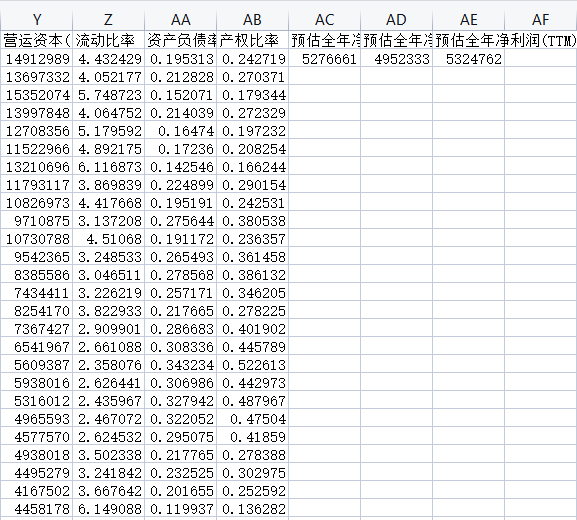

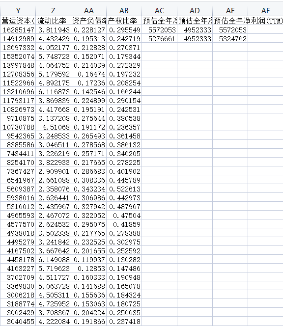

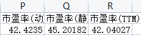

## 可视化结果

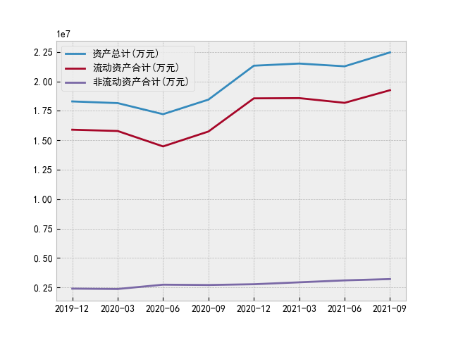

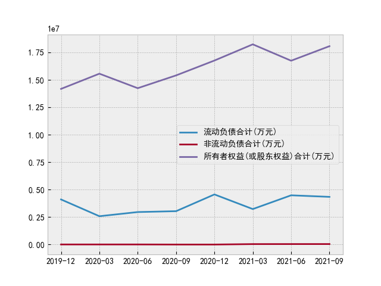

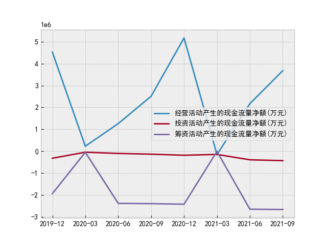

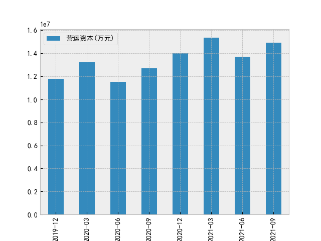

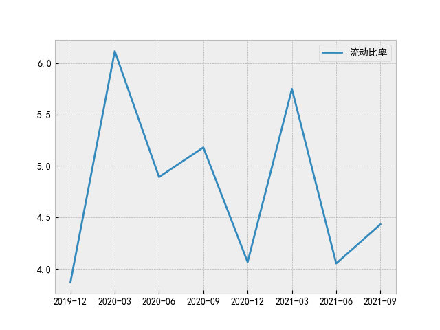

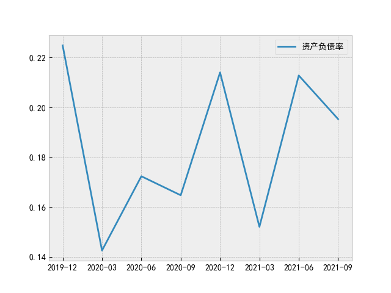

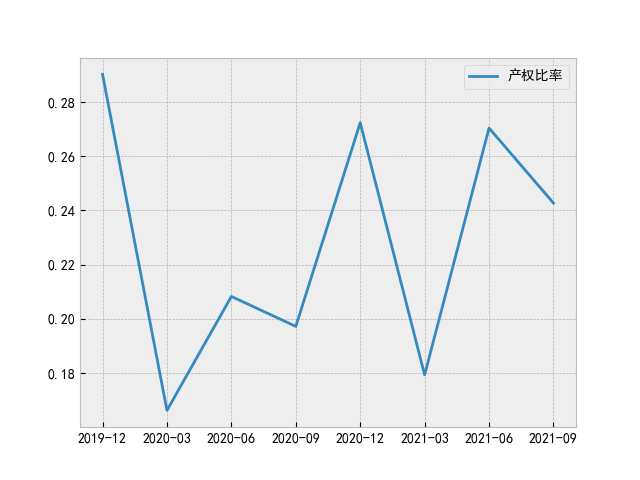

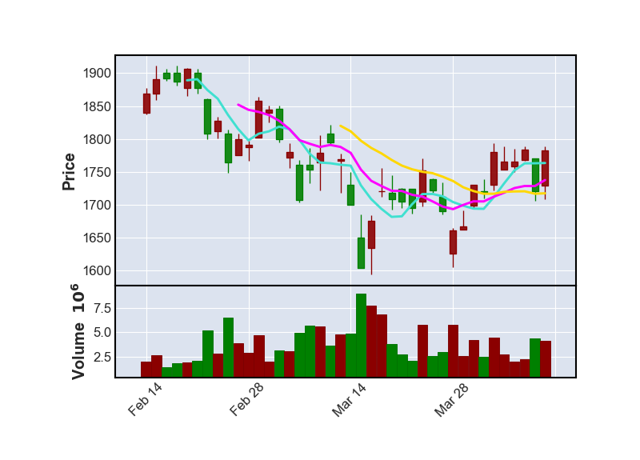

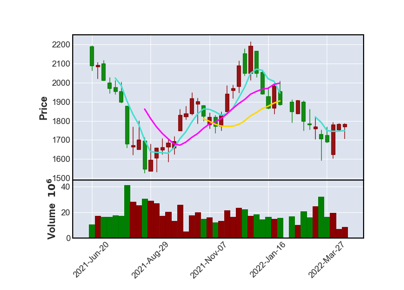

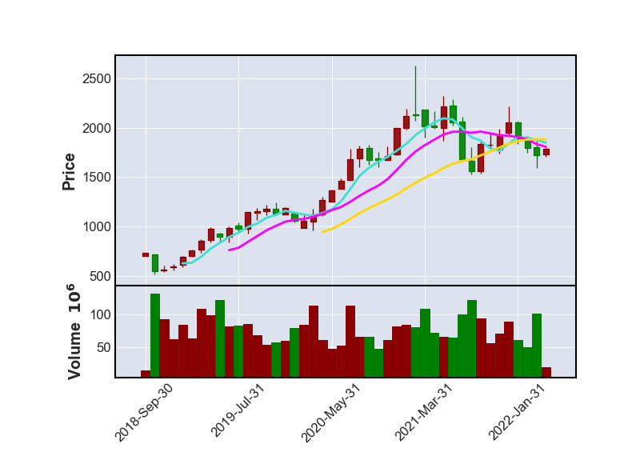
